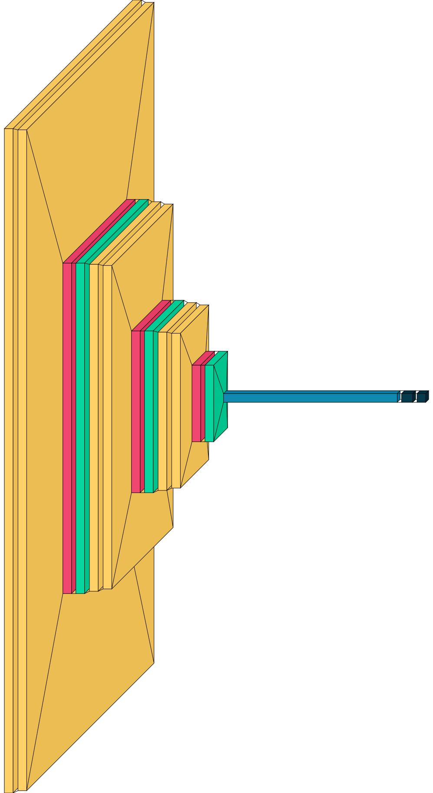
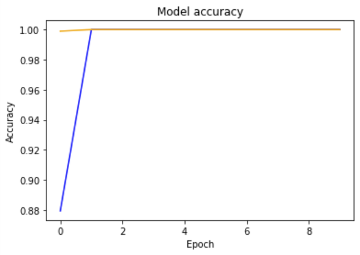

# Arknights Auto Clicker Project

## Introduction

### An auto clicker program for mobile game: Arknights, using Optical Character Recognition and Image Classification models. 

### Advantages
* Auto farming
* Without constantly clicking the screen and less annoying compared with other auto clickers (https://www.youtube.com/watch?v=HbDD7PcVKXE)
* Can detect and alert the player when all the sanity is used (to be updated)

### Demo Video


https://github.com/Ely2112/Arknights-Auto-Clicker/assets/84430363/78b9eaf9-24c2-4d3b-9af3-4aa982ce793b


Full video at [here](https://www.youtube.com/watch?v=0az1m93iW_0)

## Python Environment & Library Setup

### Create virtual environment 
```bash
python -m venv virtual_environment_name
```
virtual_environment_name can be changed to other name which fit your project name

### Activate virtual environment  
```bash
.\virtual_environment_name\Scripts\activate
```

### Required library:  
```bash
pip install -r requirements.txt
```

### If you want to install additional library:  
```bash
pip install that_library
```
Or you can add the library name in requirements.txt then pip install -r requirements.txt again

Then pip freeze the library version
```bash
pip freeze > requirements.txt
```

## How to use it?
1.  Download Bluestack (https://www.bluestacks.com/download.html), for Arknights to run on computer
2.  Single Monitor users: run main.py, then immediately switch the the Bluestack software with full screen
2.  Multiple Monitors users: Open the Bluestack software on top of your main screen then run main.py

## File Structure
```bash
├── Main/
│   ├── data/                   # folder stores folders of training data
│   │   ├── battle              # folder for training data of class "battle"
│   │   ├── battle_end          # folder for training data of class "battle_end"
│   │   ├── battle_load_color   # folder for training data of class "battle_load_color"
│   │   ├── battle_load_gray    # folder for training data of class "battle_load_gray"
│   │   ├── black               # folder for training data of class "black"
│   │   ├── end                 # folder for training data of class "end"
│   │   ├── end_icon            # folder for training data of class "end_icon"
│   │   ├── main                # folder for training data of class "main"
│   │   ├── sanity              # folder for training data of class "sanity"
│   │   └── team                # folder for training data of class "team"
│   │
│   ├── sanity  # folder stores captured image of sanity information
│   │
│   ├── venv    # virtual environment
│   │
│   ├── click_end_status.py         # click button function for "end" status
│   ├── click_main_status.py        # click button function for "main" status
│   ├── click_team_status.py        # click button function for "team" status
│   ├── main.py                     # main program
│   ├── monitor_window.py           # auto clicker monitor function 
│   ├── OCR_sanity.py               # OCR on captured sanity image function
│   ├── screen_status_detection.py  # detection of current status function
│   ├── training.ipynb              # python notebook for image classification model training
│   │                               
│   ├── requirements.txt            # pip install library
│   ├── status_detection_model.h5   # image classification model
│   ├── status.txt                  # status information
│   └── total_loop.txt              # remain loop round information
```

## Image class
Total of 4,795 images for trainig  
[Data download link](https://drive.google.com/file/d/1TFlPmTI3eOTbn6fwW6IyzQN6--7fV1zm/view?usp=sharing)

### battle


### battle_end


### battle_load_color


### battle_load_gray


### black


### end


### end_icon


### main


### sanity


### team


## Image Classification
Using Keras CNN model:  
```bash
Model: "sequential"
_________________________________________________________________
 Layer (type)                Output Shape              Param #   
=================================================================
 conv2d (Conv2D)             (None, 222, 382, 32)      896       
                                                                 
 conv2d_1 (Conv2D)           (None, 220, 380, 64)      18496     
                                                                 
 max_pooling2d (MaxPooling2D  (None, 110, 190, 64)     0         
 )                                                               
                                                                 
 dropout (Dropout)           (None, 110, 190, 64)      0         
                                                                 
 conv2d_2 (Conv2D)           (None, 108, 188, 32)      18464     
                                                                 
 conv2d_3 (Conv2D)           (None, 106, 186, 64)      18496     
                                                                 
 max_pooling2d_1 (MaxPooling  (None, 53, 93, 64)       0         
 2D)                                                             
                                                                 
 dropout_1 (Dropout)         (None, 53, 93, 64)        0         
                                                                 
 conv2d_4 (Conv2D)           (None, 51, 91, 32)        18464     
                                                                 
 conv2d_5 (Conv2D)           (None, 49, 89, 64)        18496     
                                                                 
 max_pooling2d_2 (MaxPooling  (None, 24, 44, 64)       0         
 2D)                                                             
                                                                 
 dropout_2 (Dropout)         (None, 24, 44, 64)        0         
                                                                 
 flatten (Flatten)           (None, 67584)             0         
                                                                 
 dense (Dense)               (None, 256)               17301760  
                                                                 
 dense_1 (Dense)             (None, 10)                2570      
                                                                 
=================================================================
Total params: 17,397,642
Trainable params: 17,397,642
Non-trainable params: 0
_________________________________________________________________
```
  

Accuracy: 100%, as the images are very consistent:    



The model is zipped and stored [here]([https://drive.google.com/file/d/1CVc1K4QFhE1yAgLahXg1SlxA9QjwyRQj/view?usp=sharing](https://drive.google.com/file/d/18wATNi7JYlM4ODN4kt3MN9mPg7Xf6ezB/view?usp=sharing))

## TrOCR
Using HuggingFace's TrOCR model:  
https://huggingface.co/microsoft/trocr-large-printed

#
